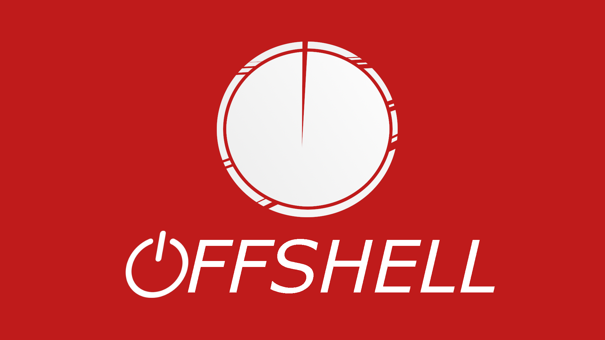

<!-- PROJECT LOGO -->
<br />
<p align="center">
  
  

  <h3 align="center">OffShell</h3>

  <p align="center">
    A Xonsh-powered shell designed with pentesting in mind.
    <br />
  <!--
    <a href="https://github.com/offsh/offshell"><strong>Explore the docs »</strong></a>
    <br />
    <br />
    <a href="https://github.com/offsh/offshell">View Demo</a>
    ·
    <a href="https://github.com/offsh/offshell/issues">Report Bug</a>
-->
    ·
    <a href="https://github.com/offsh/offshell/issues">Request Feature</a>
  </p>
</p>


<!-- TABLE OF CONTENTS -->
<details open="open">
  <summary><h2 style="display: inline-block">Table of Contents</h2></summary>
  <ol>
    <li>
      <a href="#about-the-project">About The Project</a>
      <ul>
        <li><a href="#built-with">Built With</a></li>
      </ul>
    </li>
    <li>
      <a href="#getting-started">Getting Started</a>
      <ul>
        <li><a href="#prerequisites">Prerequisites</a></li>
        <li><a href="#installation">Installation</a></li>
      </ul>
    </li>
    <li><a href="#usage">Usage</a></li>
    <li><a href="#roadmap">Roadmap</a></li>
    <li><a href="#contributing">Contributing</a></li>
    <li><a href="#license">License</a></li>
    <li><a href="#contact">Contact</a></li>
    <li><a href="#acknowledgements">Acknowledgements</a></li>
  </ol>
</details>


<!-- ABOUT THE PROJECT -->
## About The Project
Offshell is a project developed to investigate the viability of using Xonsh to record shell commands execution during a security auditory. We will combine this with Wazuh log data collection engine to analyze the generated logs and generate alerts according to the severity of the detected events.


### Built With

* [Xonsh](https://github.com/xonsh/xonsh) - Python-powered shell.
* [xxh](https://github.com/xxh/xxh) - Bring your favorite shell wherever you go through the ssh.
* [Wazuh](https://github.com/wazuh/wazuh) - The Open Source Security Platform.


<!-- GETTING STARTED -->
## Getting Started

TO DO


### Prerequisites

You need to install Offsh Xonsh appimage and a Wazuh agent.

### Installation

Install Wazuh agent in your server by following this guide: https://documentation.wazuh.com/4.0/installation-guide/wazuh-agent/

Download Xonsh:
```
sudo wget https://github.com/offsh/offshell/releases/download/0.0.2/xonsh -O /bin/xonsh
sudo chmod a+x /bin/xonsh
```
Add the Xonsh and XXH configuration:
```
curl -o ~/.xonshrc https://raw.githubusercontent.com/offsh/offshell/main/xonshrc
mkdir -p ~/.config/xxh/
curl -o ~/.config/xxh/config.xxhc https://raw.githubusercontent.com/offsh/xxh/master/config.xxhc
```

### Make it default

```
$ echo "/bin/xonsh" >> /etc/shells
# chsh -s /bin/xonsh
```


## Usage
Then, open a shell and write xonsh to start using the offshell. If you execute

```
history info
```

You would check see (among other things) your syslog filename. You should mark it for being analyzed in Wazuh configuration using a block like this one:

```
<localfile>
  <location>/home/*/.local/share/xonsh/syslog/shell_profiler.log</location>
  <log_format>syslog</log_format>
</localfile>
```

After adding that block to your ossec.conf file, if you agent is correctly connected to a Wazuh manager it woud start sending information about exeuted commands to your server and it will index it to a Elasticsearch index.

Finally, you would need to add the rules and decoders from https://github.com/offsh/offshell/tree/main/ruleset to `/var/ossec/etc/rules` and `/var/ossec/etc/decoders/`


<!-- ROADMAP -->
## Roadmap

See the [open issues](https://github.com/offsh/offshell/issues) for a list of proposed features (and known issues).


<!-- CONTRIBUTING -->
## Contributing

Contributions are what make the open source community such an amazing place to be learn, inspire, and create. Any contributions you make are **greatly appreciated**.

1. Fork the Project
2. Create your Feature Branch (`git checkout -b feature/AmazingFeature`)
3. Commit your Changes (`git commit -m 'Add some AmazingFeature'`)
4. Push to the Branch (`git push origin feature/AmazingFeature`)
5. Open a Pull Request


<!-- LICENSE -->
## License

Distributed under the GLP3 License. See `LICENSE` for more information.


<!-- CONTACT -->
## Contact

Francisco Navarro - [@twitter_handle](https://twitter.com/fnm121grg) - Navarromoralesdev@gmail.com

Project Link: [https://github.com/offsh/offshell](https://github.com/offsh/offshell)


