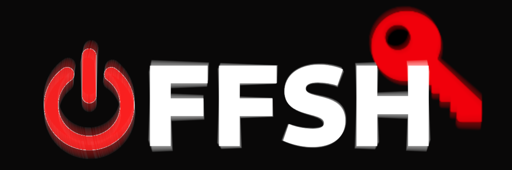

<!-- PROJECT LOGO -->
 

  

  <h3 align="center">OffShell</h3>

  

    A Xonsh-powered shell designed with pentesting in mind.
     
  <!--
    <a href="https://github.com/offsh/offshell"><strong>Explore the docs »</strong></a>
     
     
    <a href="https://github.com/offsh/offshell">View Demo</a>
    ·
    <a href="https://github.com/offsh/offshell/issues">Report Bug</a>
-->
    ·
    <a href="https://github.com/offsh/offshell/issues">Request Feature</a>
  

<!-- TABLE OF CONTENTS -->

  
<h2 style="display: inline-block">Table of Contents</h2>

  <ol>
    <li>
      <a href="#about-the-project">About The Project</a>
      <ul>
        <li><a href="#built-with">Built With</a></li>
      </ul>
    </li>
    <li>
      <a href="#getting-started">Getting Started</a>
      <ul>
        <li><a href="#prerequisites">Prerequisites</a></li>
        <li><a href="#installation">Installation</a></li>
      </ul>
    </li>
    <li><a href="#usage">Usage</a></li>
    <li><a href="#roadmap">Roadmap</a></li>
    <li><a href="#contributing">Contributing</a></li>
    <li><a href="#license">License</a></li>
    <li><a href="#contact">Contact</a></li>
    <li><a href="#acknowledgements">Acknowledgements</a></li>
  </ol>

<!-- ABOUT THE PROJECT -->
## About The Project

TODO

### Built With

* [Xonsh](https://github.com/xonsh/xonsh)  
* [Xhh](https://github.com/xxh/xxh)
* [Wazuh](https://github.com/wazuh/wazuh)

<!-- GETTING STARTED -->
## Getting Started

TO DO

### Prerequisites

TO DO

### Installation

TO DO

<!-- USAGE EXAMPLES -->
## Usage

TO DO

<!-- ROADMAP -->
## Roadmap

See the [open issues](https://github.com/offsh/offshell/issues) for a list of proposed features (and known issues).

<!-- CONTRIBUTING -->
## Contributing

Contributions are what make the open source community such an amazing place to be learn, inspire, and create. Any contributions you make are **greatly appreciated**.

1. Fork the Project
2. Create your Feature Branch (`git checkout -b feature/AmazingFeature`)
3. Commit your Changes (`git commit -m 'Add some AmazingFeature'`)
4. Push to the Branch (`git push origin feature/AmazingFeature`)
5. Open a Pull Request

<!-- LICENSE -->
## License

Distributed under the GLP3 License. See `LICENSE` for more information.

<!-- CONTACT -->
## Contact

Francisco Navarro - [@twitter_handle](https://twitter.com/fnm121grg) - Navarromoralesdev@gmail.com

Project Link: [https://github.com/offsh/offshell](https://github.com/offsh/offshell)

<!-- ACKNOWLEDGEMENTS -->
## Acknowledgements

* 
* 
* 

